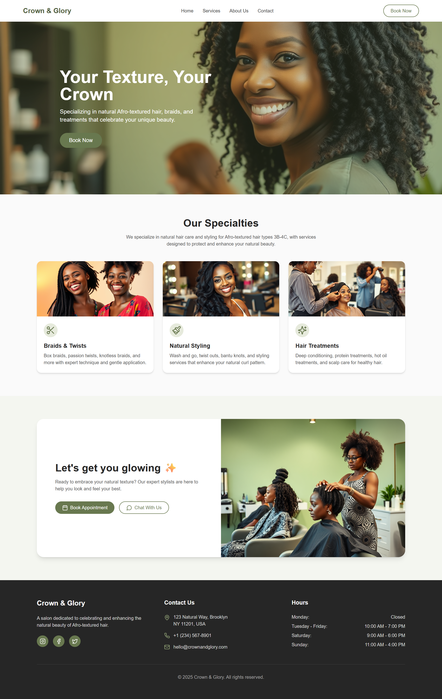

# Crown & Glory Salon Website 👑

A modern, elegant, and inclusive salon website specializing in Afro-textured hair care, built with **React** and **Tailwind CSS**.

## ✨ Features

- Fully responsive design (Desktop & Mobile)
- Clean and soft UI with muted sage and neutral tones
- Hero section with call-to-action
- Services overview with categories
- Service detail pages with booking CTA
- Booking form with date/time/service options
- About, Contact, and Promo-ready pages
- Designed with care for natural curls and coils (3B to 4C hair types)

## 📁 Pages

- `Home`
- `Services`
- `Service Details`
- `Booking`
- `About`
- `Contact`

## 🛠 Tech Stack

- React
- Tailwind CSS

## 📷 Preview




## 🚀 Getting Started

1. Clone the repo:
   ```bash
   git clone https://github.com/dilminekanayaka/crown-glory-hair-salon-website-react-tailwindcss.git
   cd crown-glory-hair-salon-website-react-tailwindcss
